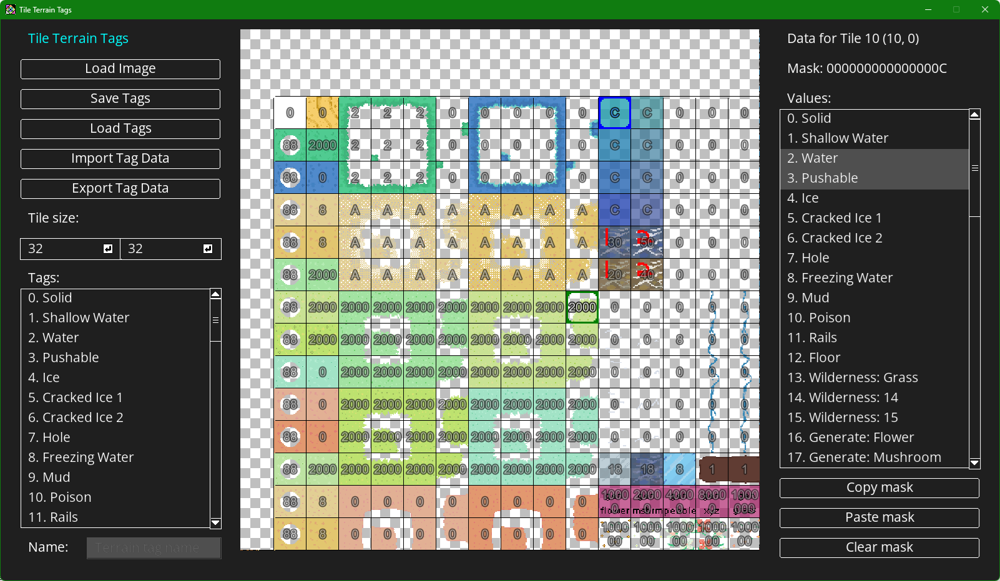

# TileTerrainTags

Here's a program I wrote for dealing with tile tags in [Wizarducks and the Lost Hat](https://store.steampowered.com/app/2769920/Wizarducks_and_the_Lost_Hat/).

Define tags and stick them on tiles in the editor. Export them to your game's included files when you're done.

Look up a tag on a tilemap tile with a function like this.

    /// @desc This function fetches the terrain tag for a tile on a specific tilemap. There are no bounds checks on this function, so if you pass it bad data the game will crash.
    function get_tilemap_terrain_tag(tilemap, cell_x, cell_y) {
        static terrain_tag_lookups = { };
        
        if (tilemap == -1) return 0;
        
        var tileset = tilemap_get_tileset(tilemap);
        var tileset_name = tileset_get_name(tileset);
        
        if (!struct_exists(terrain_tag_lookups, tileset_name)) {
            terrain_tag_lookups[$ tileset_name] = buffer_load($"{tileset_name}.tag");
        }
        
        var tilemap_tag_data = terrain_tag_lookups[$ tileset_name];
        
        var tile_index = tile_get_index(tilemap_get(tilemap, cell_x, cell_y))
        return buffer_peek(tilemap_tag_data, tile_index * buffer_sizeof(buffer_u64), buffer_u64);
    }
    

Each tag should be a bit flag of some sort. When you look up the tag on a tile, `&` it with the flag to see if it's included.

    enum ETileTags {
        NONE                = 0b0000,
        SOLID               = 0b0001,
        WATER               = 0b0010,
        ICE                 = 0b0100,
        POISON              = 0b1000
    }

Now that IDE plugins are kind of a thing, I'll probably remake this as an IDE plugin at some point.

# Disclaimers

This isn't a difficult system to use, and it should only take like a minute of work to set it up. However, copying and pasting the above function into your project without thinking about it probably won't work. I will not provide personal assistance integrating this into your game ([unless you pay me](https://www.patreon.com/c/wizardragon)).

I think most of you will have the common sense to do that, but any time I release an asset I get messages about stuff like this and I'm not going to lie, I expect better.